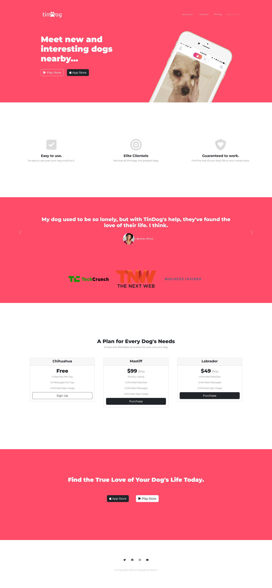
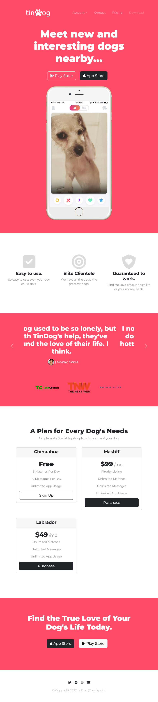
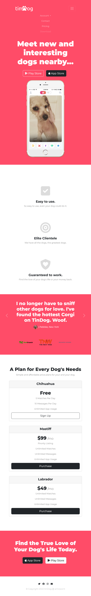

# TinDog page with curved sections solution

This is a solution to the TinDog page with curved sections challenge.

## Table of contents

- [Overview](#overview)
  - [The challenge](#the-challenge)
  - [Screenshot](#screenshot)
  - [Links](#links)
- [My process](#my-process)
  - [Built with](#built-with)
  - [What I learned](#what-i-learned)
  - [Continued development](#continued-development)
  - [Useful resources](#useful-resources)
- [Author](#author)
- [Acknowledgments](#acknowledgments)
- [All Designs](#all-designs)

## Overview
### The challenge

Users should be able to:

- View the optimal layout for the site depending on their device's screen size
- See hover states for all interactive elements on the page

### Screenshot

### Links

- Live Site URL: [amirpoint.github.io/tindog-start-master/](https://amirpoint.github.io/tindog-start-master/)

## My process

### Built with

- Semantic HTML5 markup
- CSS custom properties
- Flexbox
- CSS Grid
- Bootstrap Navbar
- Bootstrap Carousel
- Bootstrap Card
- [Styled Components](https://styled-components.com/) - For styles

### What I learned

Use this section to recap over some of your major learnings while working through this project. Writing these out and providing code samples of areas you want to highlight is a great way to reinforce your own knowledge.

### Useful resources

- [resource I](https://getbootstrap.com/docs/5.2/getting-started/introduction/)
- [resource II](https://devdocs.io/)

## Author

- London App Brewery - [Link](https://github.com/londonappbrewery)
- Telegram - [@amirpoint](https://www.t.me/amirpoint)

## Acknowledgments

This is where you can give a hat tip to anyone who helped you out on this project. Perhaps you worked in a team or got some inspiration from someone else's solution. This is the perfect place to give them some credit.

## All Designs

### Desktop Design

### Tablet Design

    
    

### Mobile Design

